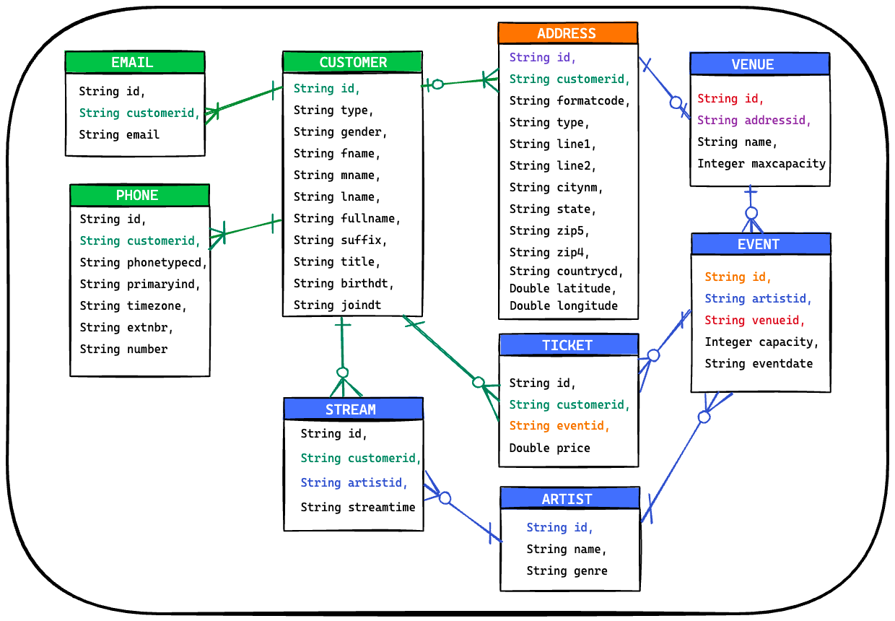
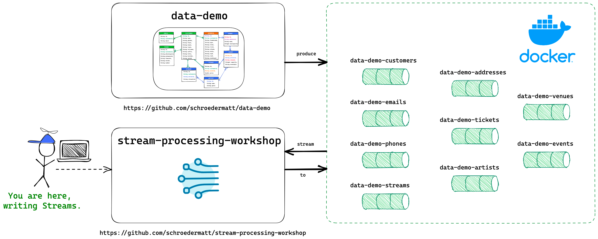
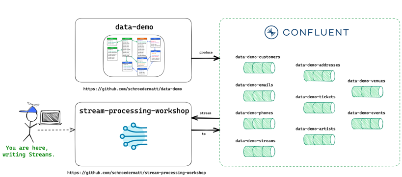

# Stream Processing Workshop

The Stream Processing Workshop intends to accelerate your journey to building real-time applications using technologies like Kafka, Kafka Streams, and more.

The workshop's data and target scenarios surround a young music-centric business, "Utopia".

## Utopia Background

Utopia is an up and coming music business. They are building a suite of digital products on top of a simple data set with the goal of doing a few things really well rather than trying to do it all. The full data model can be found in the Appendix.

The Utopia founders built the platform’s MVP with PostgreSQL, a relational database. This worked well and attracted enough users and attention to secure seed funding. However, the vision that they’ve sold to the investors relies heavily on event-driven architecture, designs, and technologies. The Utopia team has limited experience in this space and are looking for help.

_Enter you._

Utopia hand selected a group of engineers to explore, design, and begin building the first full-featured release of Utopia. Many of the features rely on the data being available in real-time so that users are aware of events as they happen.

You are going to explore the data, learn about Kafka Streams, and build Streams to answer valuable questions about the data such as -
* Who is the most streamed artist on the platform?
* Who are each customer's top 3 artists?
* Which venues are hosting the most events?
* Which events are nearing sell-out?
* ... and more!

## Domain Model

The below ERD illustrates the data available in the workshop. Brief descriptions of each entity are below the diagram.



* Customer - the Utopia customer stores the core profile information and is related to the customer’s Email(s), Phone(s) and Address(es). The customer can also Stream artists and purchase Ticket(s) to Event(s).
* Email - the email data has a unique identifier, a foreign key linking it to a customer, and the email address.
* Phone - the phone data has a unique identifier, a foreign key linking it to a customer, and the phone details.
* Address - the address table is overloaded and used for customers as well as venues. The table has a unique identifier and a foreign key to a customer (when linked to a customer). It also stores standard address details.
* Stream - the stream data is the point in time (streamtime) that a customer streamed an artist.
* Ticket - the Ticket holds price that the Customer paid to go to an Event. It has a unique identifier and also foreign keys to the customer and event it’s related to.
* Artist - the Artist holds very basic details about an artist (name & genre). There is a unique identifier that is used to relate the artist to streams and events.
* Event - the Event table has a unique identifier and information about an event’s date as well as the max capacity. The event is related to a venue and an artist as well as the tickets that a customer can purchase.
* Venue - the Venue is a physical space that hosts events. It has a unique identifier as well as a name, address, and max capacity.

## Getting Started

Before getting started, Fork this repository into your own GitHub account. That way, you can do whatever you want to it!

Once Forked & Cloned, you can pick which runtime mode you prefer.

1) [Test Driven Development Environment](#test-driven-development-environment)
2) [Local Environment](#local-environment)
3) [Confluent Cloud Environment](#confluent-cloud-environment)

### Test Driven Development Environment

The TopologyTestDriver can simulate the entire streams process and you can accomplish what you need via good tests.

See existing tests like [CustomerStreamCountSpec](./src/test/groovy/org/improving/workshop/samples/CustomerStreamCountSpec.groovy), [PurchaseEventTicketSpec](./src/test/groovy/org/improving/workshop/samples/PurchaseEventTicketSpec.groovy), [TopCustomerArtistsSpec](./src/test/groovy/org/improving/workshop/samples/TopCustomerArtistsSpec.groovy) for inspiration.

### Local Environment

If you want to run this project against a local Kafka cluster with mock data then head over to [data-demo](https://github.com/schroedermatt/data-demo) and walk through the readme to get started. It has everything you need to start a local environment and start producing the mock data for this workshop to your environment. 



When running locally, your settings in `Streams.buildProperties()` should look like below.

```
// Streams.java

        // This ensures you have a unique consumer group name and your streams don't cross with other workshop attendees
        // If you're running locally in an isolated environment, feel free to make this a static value.
        streamsConfiguration.put(StreamsConfig.APPLICATION_ID_CONFIG, "kafka-workshop-example-" + UUID.randomUUID());

        // POINT TO LOCAL BOOTSTRAP SERVER
        streamsConfiguration.put(StreamsConfig.BOOTSTRAP_SERVERS_CONFIG, "localhost:19092,localhost:29092,localhost:39092");
        
        // COMMENT OUT CCLOUD BOOTSTRAP SERVER
        // streamsConfiguration.put(StreamsConfig.BOOTSTRAP_SERVERS_CONFIG, "pkc-ywvz6.us-east-2.aws.confluent.cloud:9092");

        // COMMENT OUT CCLOUD SECURITY SETTINGS
        // streamsConfiguration.put(StreamsConfig.SECURITY_PROTOCOL_CONFIG, "SASL_SSL");
        // streamsConfiguration.put("sasl.jaas.config", "org.apache.kafka.common.security.plain.PlainLoginModule required username='*' password='*';");
        // streamsConfiguration.put("sasl.mechanism", "PLAIN");
```

### Confluent Cloud Environment

If you are doing this workshop in a shared Confluent Cloud environment. You will need the bootstrap server, username, and password values. With these, you can modify your `Streams.buildProperties()` so that it looks like below.



```
// Streams.java

        // This ensures you have a unique consumer group name and your streams don't cross with other workshop attendees
        streamsConfiguration.put(StreamsConfig.APPLICATION_ID_CONFIG, "kafka-workshop-example-" + UUID.randomUUID());

        // COMMENT OUT LOCAL BOOTSTRAP SERVER
        // streamsConfiguration.put(StreamsConfig.BOOTSTRAP_SERVERS_CONFIG, "localhost:19092,localhost:29092,localhost:39092");
        
        // CCLOUD BOOTSTRAP SERVER
        streamsConfiguration.put(StreamsConfig.BOOTSTRAP_SERVERS_CONFIG, "pkc-ywvz6.us-east-2.aws.confluent.cloud:9092");

        // CCLOUD SECURITY SETTINGS
        streamsConfiguration.put(StreamsConfig.SECURITY_PROTOCOL_CONFIG, "SASL_SSL");
        streamsConfiguration.put("sasl.jaas.config", "org.apache.kafka.common.security.plain.PlainLoginModule required username='*' password='*';");
        streamsConfiguration.put("sasl.mechanism", "PLAIN");
```

#### Confluent Cloud Access

There are a few access requirements that are in place to ensure that your workshop goes smoothly.

* Your consumer groups have READ access only to "data-demo-*" topics, don't try to write back to them.
* Your Application ID (Consumer Group Name) MUST start with "kafka-workshop-"
* Your Output Topics MUST start with "kafka-workshop-" (ex. kafka-workshop-total-customer-streams)
  * When defining your output topics, add a unique identifier to them to ensure they're unique.

#### Confluent Cloud Consumer Groups

To ensure that streams don't cross between attendees, the `Streams.buildProperties()` assigns a random application id (consumer group name) each time a stream starts up. This is also helpful in testing streams because it will force the stream to reconsume all data on each startup.

```
streamsConfiguration.put(StreamsConfig.APPLICATION_ID_CONFIG, "kafka-workshop-example-" + UUID.randomUUID());
```

If you do not want this to happen, modify the `application.id` to a unique value that you know won't conflict with another attendees.

**The group name must start with "kafka-workshop-"**

```
streamsConfiguration.put(StreamsConfig.APPLICATION_ID_CONFIG, "kafka-workshop-this-is-so-unique-its-crazy");
```

#### Confluent Cloud Topics

Your Output Topics MUST start with "kafka-workshop-" (ex. kafka-workshop-total-customer-streams). However, the cluster is shared so it is recommended that you inject a unique identifier into all of your topic names to avoid topic clashes with other attendees.

So rather than `kafka-workshop-top-streams`, maybe use `kafka-workshop-top-streams-team-bigfoot` and suffix it with your team name.

## Stream Processing Scenarios

Utopia has big dreams and they need your help. For each of the scenarios below,

1) Draw the topology -- you can import [workshop-template.excalidraw](./assets/excalidraw/workshop-template.excalidraw) into [Excalidraw](https://excalidraw.com) for a jump start. The template has a reusable icon set and sample topologies.
2) Implement the topology -- see the [Samples](#samples) for inspiration and leverage the [StreamTemplate](./src/main/java/org/improving/workshop/StreamTemplate.java) as a starting point.
3) Test the topology with the TopologyTestDriver -- see the tests tied to the [Samples](#samples) for inspiration.

### MOST STREAMED ARTISTS

Context: A Customer streams (listens to) an artist.

Goals:
- Find the top 3 streamed artists across all customers.
- Find the top 3 streamed artists for each customer (completed -- see [TopCustomerArtists](#TopCustomerArtists) sample)
- BONUS) Group the customers that have the same top streamed artist.

### SOLD OUT EVENT

Context: Artists have events and customers book tickets to an event. Each event has a capacity (max tickets).

Goals:
- Alert when an event is within 10% of max capacity.
- Alert when an event is sold out.
- BONUS) Alert the event artist's top streamers when an event is created.

### MUST SEE VENUE

Context: Artists have events at a venue.

Goals:
- Find the venue that has hosted the most events.
- Find the venue that has hosted the most customers.

### SUGGESTED EVENTS - GENRE

Context: Customers stream artists and each artist has a genre.

Goals:
- Alert customer when an event is created in their most streamed genre.
- BONUS) Alert customer when there is a popular* event within their most streamed genre.
    - *popular: within 10% max capacity (almost sold out)

### SUGGESTED EVENTS - LOCATION

_Note - the fake data generation may not be accurate enough for location based scenarios._

Context: Customers have an address that indicates their location.

Goals:
- Find all tickets purchased by customers in each zipcode.
- BONUS) Alert customer when customers in their zipcode are buying tickets to a popular* event.
    - *popular: within 10% max capacity

## Samples

### CustomerStreamCount

Find the total Stream count for each Customer.

* Solution: [CustomerStreamCount](./src/main/java/org/improving/workshop/samples/CustomerStreamCount.java)
* Test: [CustomerStreamCountSpec](./src/test/groovy/org/improving/workshop/samples/CustomerStreamCountSpec.groovy)
* Topology: [Customer Stream Count Topology](./assets/samples/total-customer-stream-count.png)

### TopCustomerArtists

Find the Top 3 Streamed Artists for each Customer.

* Solution: [TopCustomerArtists](./src/main/java/org/improving/workshop/samples/TopCustomerArtists.java)
* Test: [TopCustomerArtistsSpec](./src/test/groovy/org/improving/workshop/samples/TopCustomerArtistsSpec.groovy)
* Topology: [Top 3 Customer Artists Topology](./assets/samples/top-3-artists.png)

### PurchaseEventTicket

Accept Ticket requests and respond with CONFIRMED if the Event has remaining tickets or REJECTED if the Event has sold out.

* Solution: [CustomerStreamCount](./src/main/java/org/improving/workshop/samples/PurchaseEventTicket.java)
* Test: [CustomerStreamCountSpec](./src/test/groovy/org/improving/workshop/samples/PurchaseEventTicketSpec.groovy)
* Topology: [Purchase Event Ticket Topology](./assets/samples/purchase-event-ticket.png)